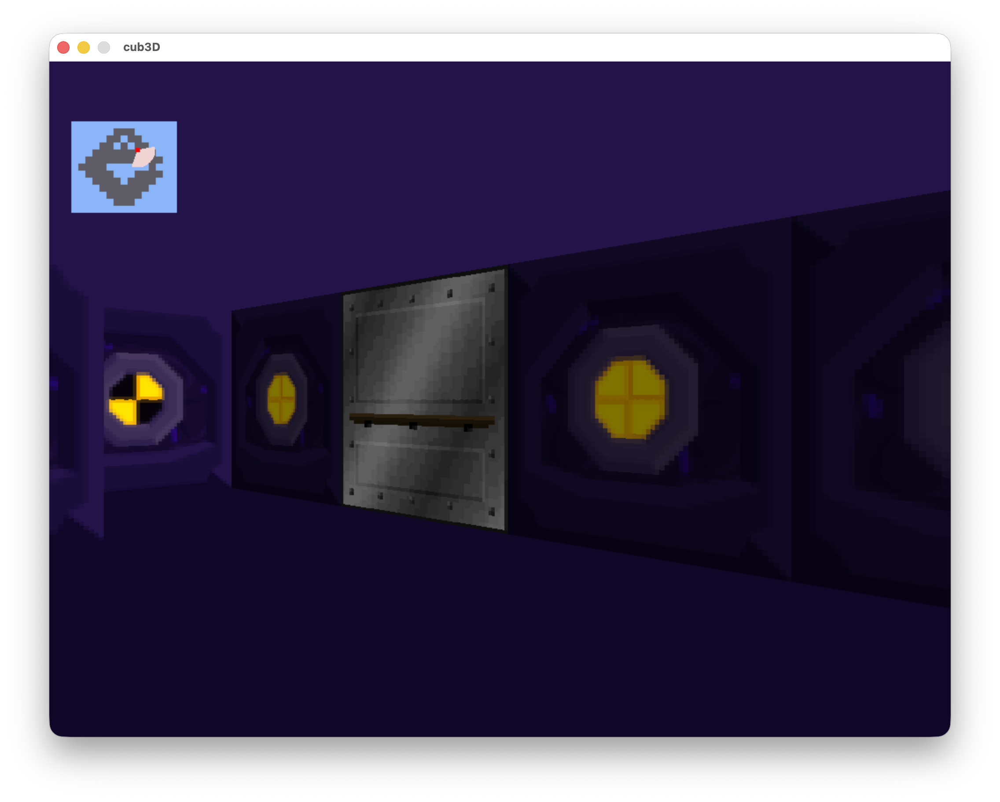

# cub3D

A raycasting 3D game engine built as a project at School 42, inspired by the original Wolfenstein 3D. The engine renders a first-person perspective of a maze defined by a `.cub` configuration file.

---



---

## Features

- Raycasting-based 3D rendering using DDA (Digital Differential Analysis)
- Textured walls with directional textures (North, South, East, West)
- Animated sprite rendering
- Door system with open/close mechanics
- Minimap overlay
- Mouse look with horizontal rotation
- Cross-platform: Linux and macOS

---

## Requirements

**Linux**
- GCC or Clang
- X11 and Xext development libraries (`libx11-dev`, `libxext-dev`)
- `make`

**macOS**
- Xcode Command Line Tools (`xcode-select --install`)
- `make`

No additional installation is needed — minilibx is bundled as a submodule.

---

## Building

Clone the repository with submodules:

```sh
git clone --recurse-submodules <repo-url>
cd cub3d
```

If you already cloned without submodules:

```sh
git submodule update --init --recursive
```

Build the project:

```sh
make
```

The Makefile detects your OS automatically and links against the correct minilibx version.

---

## Running

```sh
./cub3D maps/good/subject_map.cub
```

The `.cub` file defines textures, floor and ceiling colors, and the map layout.

---

## Map format

A `.cub` file consists of a configuration header followed by the map grid.

```
NO textures/north_wall.xpm
SO textures/south_wall.xpm
WE textures/west_wall.xpm
EA textures/east_wall.xpm

F 69,222,199
C 235,198,52

111111
100N01
100001
111111
```

**Configuration keys:**
- `NO` / `SO` / `WE` / `EA` — wall textures for each cardinal direction
- `F` — floor color as `R,G,B`
- `C` — ceiling color as `R,G,B`

**Map characters:**
- `1` — wall
- `0` — empty floor
- `N` / `S` / `E` / `W` — player spawn position and facing direction
- `D` — door
- `L` — lamp sprite

The map must be enclosed by walls on all sides.

---

## Controls

| Key | Action |
|-----|--------|
| W / Arrow Up | Move forward |
| S / Arrow Down | Move backward |
| A | Strafe left |
| D | Strafe right |
| Left Arrow | Rotate left |
| Right Arrow | Rotate right |
| Mouse | Horizontal look |
| ESC | Quit |

---

## Memory leak checking

The repository includes a `vg` utility that runs the game under Valgrind with a system-library suppression file:

```sh
./vg maps/good/subject_map.cub
```

This runs `valgrind --leak-check=full --show-leak-kinds=all --track-origins=yes` with `ignore_system_only.supp` applied so that leaks originating inside X11 or system libraries are suppressed, keeping the output focused on project code.

Note: `vg` is a Linux-only tool. Valgrind is not available on macOS.

---

## Project structure

```
cub3D/
  assets/                Screenshots
  inc/                   Header files
  src/
    modules/
      events/            Keyboard and mouse input
      graphics/          Raycasting, rendering, textures, doors, minimap
      mlx/               MLX initialization
      utils/             Init and cleanup
      validation/        Map and config parsing/validation
      error/             Error reporting
  lib/
    libft/               42 standard library
    minilibx-linux/      MiniLibX for Linux (submodule)
    minilibx-macos/      MiniLibX for macOS (submodule)
  maps/
    good/                Valid example maps
    bad/                 Invalid maps for testing error handling
  textures/              XPM texture assets
```
